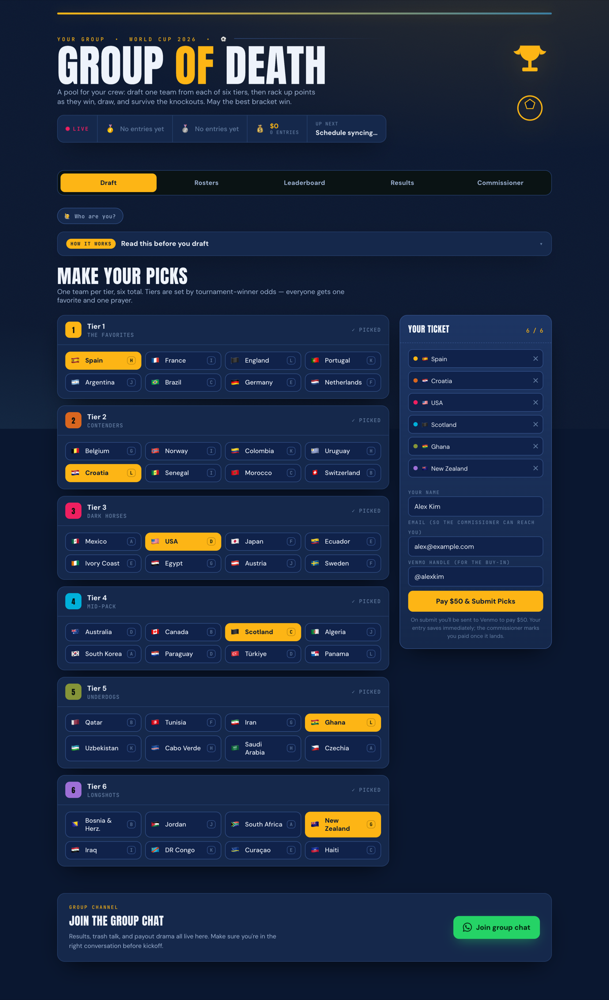

# Group of Death — World Cup 2026 Pool

A tiered fantasy-draft pool for the FIFA World Cup 2026 that you can stand up for your own group of friends or coworkers. Each player drafts **one team from each of six odds-based tiers**, then scores points as those teams win, draw, and advance through the knockouts.

<!-- Replace with a real screenshot or GIF of your pool — it's the single biggest driver of people trying it.
     Add the image to a docs/ folder and point to it here, e.g.  -->
<p align="center"><em>📸 Add a screenshot of the leaderboard or draft screen here.</em></p>

[](https://vercel.com/new/clone?repository-url=https%3A%2F%2Fgithub.com%2Fashokechakrabarti%2Fworld-cup-pool&env=DATABASE_URL,FOOTBALL_DATA_TOKEN,ANTHROPIC_API_KEY,ODDS_API_KEY,POOL_VENMO_HANDLE&envDescription=Only%20DATABASE_URL%20is%20required%3B%20the%20rest%20are%20optional&envLink=https%3A%2F%2Fgithub.com%2Fashokechakrabarti%2Fworld-cup-pool%23environment-variables)

> One-click deploy fills in the env vars as you go. You'll still need a Postgres database (see [What you'll need](#what-youll-need-all-have-free-tiers)) — `DATABASE_URL` is the only required value.

- **Draft** one team per tier (favorites → longshots)
- **Pay** the buy-in via a Venmo deep link on submit
- **Leaderboard / Rosters / Results** update live
- **Daily Picks** — an optional side-game: pick the winner of every knockout match, $1 a pick
- **Commissioner tab** to mark payments, collect emails, lock entries, and tune scoring
- **Results sync automatically** from football-data.org, with a commissioner override
- **AI commentary booth** (optional) — two pundits roast the standings using the Anthropic API

**Stack:** Next.js (App Router) · Postgres · football-data.org feed. No build-time secrets; the database schema creates itself on first request.

> **Use this template:** click **“Use this template” → “Create a new repository”** on GitHub to get your own clean copy, then follow the steps below.

---

## What you'll need (all have free tiers)

1. **A Postgres database** — [Neon](https://neon.tech) (recommended), Vercel Postgres, or Supabase. Copy its connection string.
2. **A Vercel account** — https://vercel.com (the Hobby tier is fine for hosting).
3. *(Recommended)* **A football-data.org API token** — free at https://www.football-data.org/client/register (the World Cup is on the free tier, 10 calls/min). Powers automatic results sync. Skip it and you just enter results by hand.
4. *(Optional)* **An Anthropic API key** — from https://console.anthropic.com, for the AI commentary booth.
5. *(Optional)* **A the-odds-api.com key** — free, for live over/under lines on Daily Picks.

---

## Deploy (about 15 minutes)

1. Create your repo from this template (or push your copy to GitHub).
2. In Vercel: **Add New → Project → import the repo.**
3. Add **Environment Variables** (Project → Settings → Environment Variables). See [the table below](#environment-variables) — at minimum set `DATABASE_URL`.
4. **Deploy.** Open the URL — the database tables are created automatically on first load, and a config row is seeded with the default scoring.
5. Open the **Commissioner** tab (default code `1986`), **immediately change the code**, set your Venmo handle and buy-in, confirm the scoring, then share the URL with your group.

### Environment variables

| Name | Required? | What it's for |
|---|---|---|
| `DATABASE_URL` | **Yes** | Postgres connection string. Include `?sslmode=require` for hosted DBs. |
| `FOOTBALL_DATA_TOKEN` | Recommended | Auto-syncs match results. Without it, enter results manually. |
| `ANTHROPIC_API_KEY` | Optional | Enables the AI commentary booth. Without it, the booth is hidden. |
| `ODDS_API_KEY` | Optional | Live over/under lines for Daily Picks. Falls back to a fixed 2.5 line. |
| `POOL_VENMO_HANDLE` | Optional | Seeds the payee on first run; also editable in the Commissioner tab. |
| `CRON_SECRET` | Optional | Protects `/api/cron/sync` if you enable Vercel Cron. Any random string. |
| `BASE_PATH` | Optional | Set **only** if serving under a sub-path (e.g. `/worldcup2026`). See note below. |

> **Sub-path note:** by default the app serves from your domain root — leave `BASE_PATH` unset. If you serve it under a sub-path, set `BASE_PATH=/yourpath` **and** prefix the cron path in `vercel.json` to match (e.g. `/yourpath/api/cron/sync`).

---

## Run locally

```bash
cp .env.example .env       # fill in DATABASE_URL (+ optional tokens)
npm install
npm run dev                # http://localhost:3000
```

For a local non-SSL Postgres, also set `PGSSL=disable` in `.env`.

---

## Make it yours

Everything below is optional customization. The defaults work out of the box.

- **Name, colors & header** — edit the title in [`app/layout.js`](app/layout.js), the header copy in [`app/page.js`](app/page.js), and the theme palette (`--bg`, `--pitch`, etc.) at the top of [`app/globals.css`](app/globals.css). Swap the emblem SVG in `app/page.js` for your own crest if you like.
- **Group chat link** — replace the placeholder invite URL in the footer of [`app/page.js`](app/page.js) with your own WhatsApp/Signal/etc. link.
- **Buy-in & Venmo handle** — set in the Commissioner tab at runtime (no redeploy needed).
- **Scoring** — defaults are Group win **3** / draw **1**; knockouts escalate R32 **4**, R16 **6**, QF **10**, SF **15**, Final **25**. Editable live in the Commissioner tab; the seed values live in `DEFAULT_SCORING` in [`lib/teams.js`](lib/teams.js).
- **Teams & tiers** — the team list, group letters, and tier assignments live in the `RAW` array in [`lib/teams.js`](lib/teams.js). Tiers were set from winner odds ~10 days before the 2026 tournament; adjust as you like. **⚠️ Don't reorder the array** — entry picks store the team **index**, so reordering scrambles existing picks. Append or edit in place instead.
- **AI commentary booth** — the two pundits and their brief live in the `SYSTEM` prompt in [`app/api/commentary/route.js`](app/api/commentary/route.js). The optional player “dossiers” that make the roasts personal live in [`lib/profiles.js`](lib/profiles.js) — **only add real details about people who've agreed to be in your private pool; don't commit personal data to a public repo.**

---

## How results sync

Once the tournament starts (June 11, 2026), the app refreshes finished matches from football-data.org **on read, at most once every ~4 minutes** (`/api/state`). This keeps it current on free hosting with no cron required.

A cron route also exists at `/api/cron/sync` and is scheduled in `vercel.json` (daily). Vercel's Hobby plan limits cron frequency, so the lazy on-read sync above is the primary mechanism; the cron is a bonus on Pro.

**Commissioner override is the source of truth.** Feed results are stored with `source='feed'` and never overwrite a `source='manual'` row. Use the “Enter a result” form for anything the feed lags on — most importantly knockout penalty-shootout winners.

---

## Data model

- `pool_config` — single row: buy-in, venmo handle, commissioner code, lock flag, scoring (JSONB), last sync time
- `entries` — name, email, venmo, paid flag, picks (6 team indices), edit code, created_at
- `matches` — stage, two teams, score, knockout winner, source (`feed`/`manual`)
- `daily_picks` — per-player per-match winner predictions for the Daily Picks side-game

Teams, tiers, and stages live in [`lib/teams.js`](lib/teams.js) (the single source of truth — entry picks store the team **index**, so don't reorder that array).

---

## Notes & caveats

- **Team-name / stage mapping:** `lib/teams.js` maps football-data.org names to ours (e.g. “United States”→USA, “Korea Republic”→South Korea) and their stage enums (`LAST_32`→R32, etc.). If the live feed labels something differently, add an alias there — or just use the commissioner override.
- **Commissioner code** is lightweight gating, not real auth — fine for a friends pool, but don't treat it as secure. Change the `1986` default immediately.
- **Money:** the app records pay *intent* and deep-links to Venmo; the commissioner confirms receipt manually. Venmo has no API to verify payment. Heads-up: real-money pools sit in a gray area under Venmo's ToS and vary by jurisdiction — fine for a small private group, but it's on you to know your local rules.

---

## License

[MIT](LICENSE) — do whatever you like, just keep the copyright notice. Have fun, and go enjoy the World Cup.
